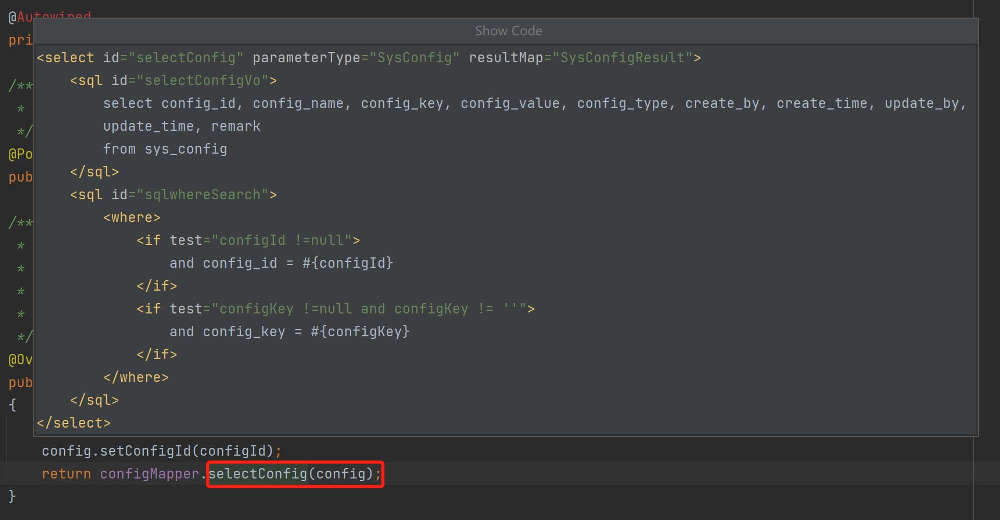
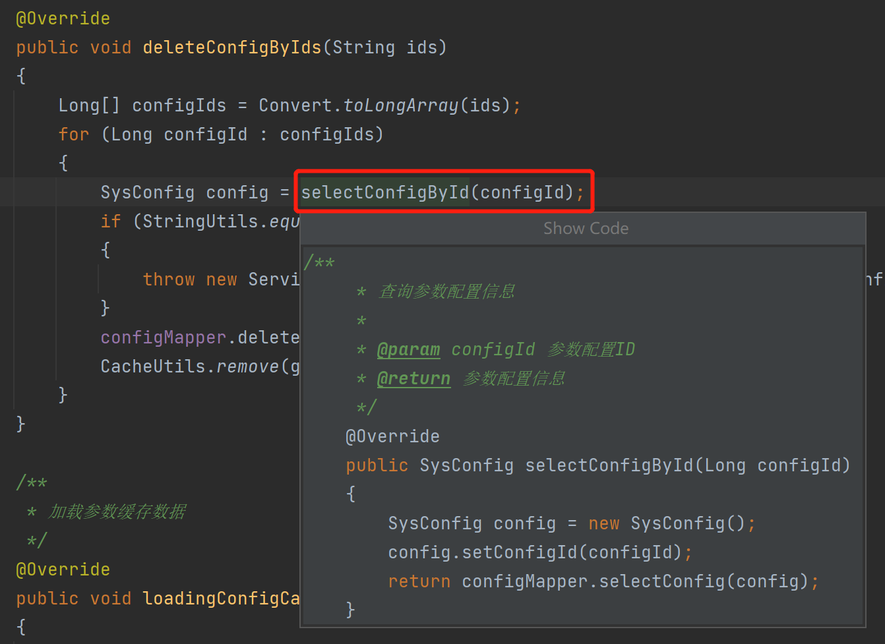
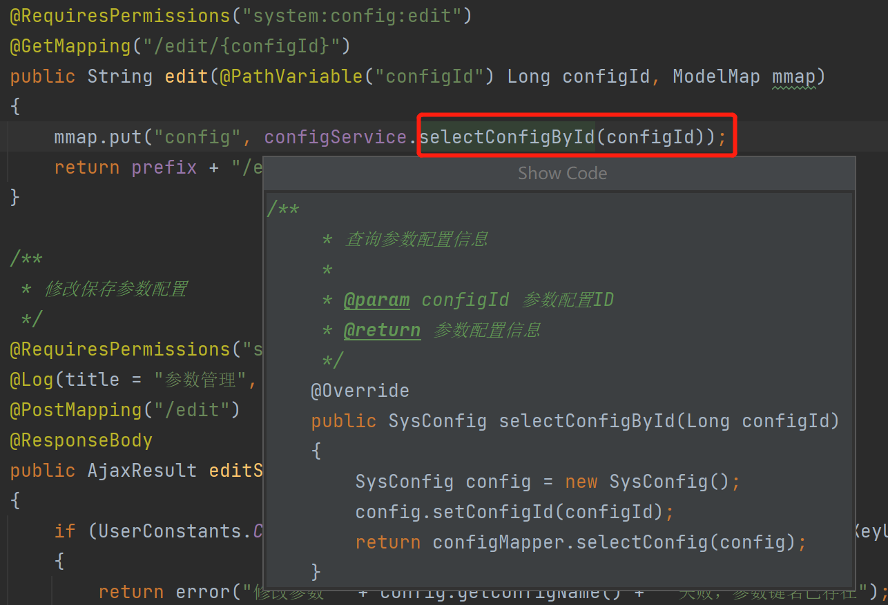
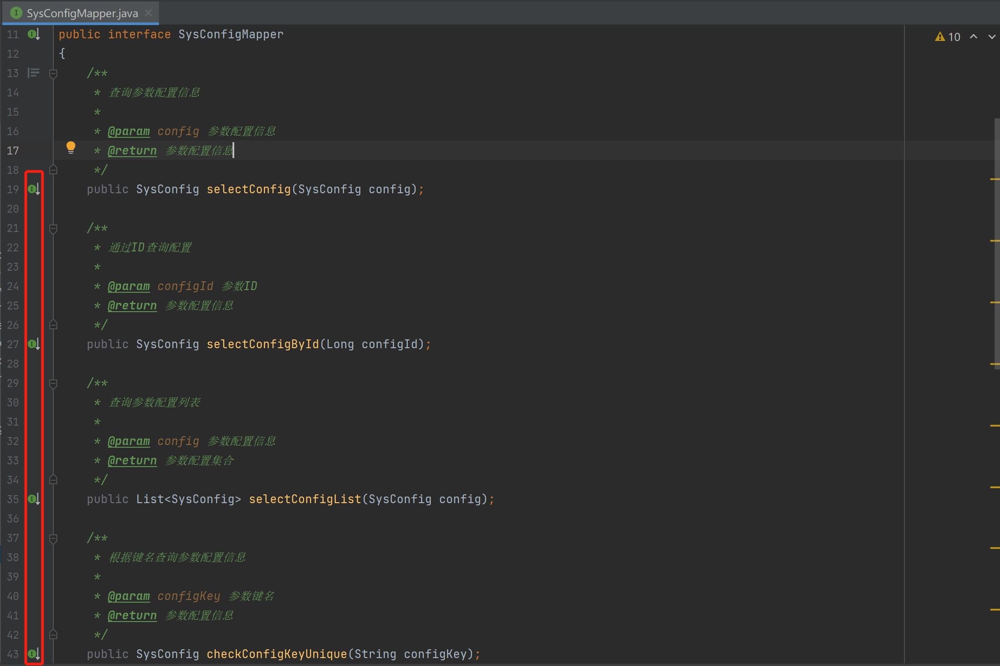
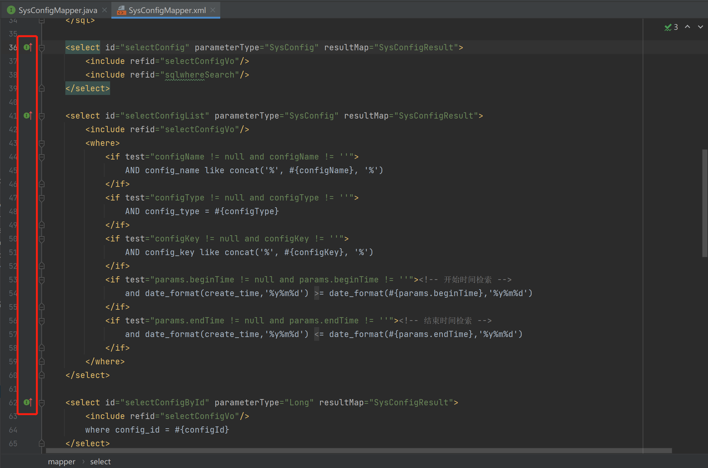

	

<h1 align="center" style="margin: 30px 0 30px; font-weight: bold;">Idea-Plugin-Observer</h1>

## 中文简介
在右键菜单中，增加"Show Code"选项，它可以在当前位置弹出一个窗口来查看具体代码。
1. 当你的光标处在一个函数上时，使用"Show Code"可以在弹出框内看到这个函数的具体代码。
2. 当你的光标处在一个实体类的get或set函数上时，使用"Show Code"可以在弹出框内看到对应字段的代码。
3. 当你的光标处在Mybatis的函数上时，使用"Show Code"可以在弹出框内看到对应的SQL，并且解析了<include />节点。
4. Mybatis的mapper接口和对应的mapper.xml中，增加了相互跳转的按钮。
5. Mybatis的mapper支持"ctrl+alt+鼠标左键"和"ctrl+B"快捷键代码跳转。

## Introduction in English
To add a "Show Code" option to the right-click menu, which pops up a window to view the specific code at the current position.
1. When the cursor is on a function, using "Show Code" displays the specific code of that function in the pop-up window.
2. When the cursor is on a get or set function of an entity class, using "Show Code" displays the code of the corresponding field in the pop-up window.
3. When the cursor is on a Mybatis function, using "Show Code" displays the corresponding SQL in the pop-up window, and it also parses the <include /> nodes.
4. In the Mybatis mapper interface and its corresponding mapper.xml, buttons are added to enable jumping back and forth between them.
5. Mybatis mapper supports "ctrl+alt+ left mouse button "and "ctrl+B" shortcut key code jump.

## 预览图 / Preview image
<table>
    <tr>
        <td></td>
        <td></td>
    </tr>
    <tr>
        <td></td>
        <td></td>
    </tr>
    <tr>
        <td></td>
        <td></td>
    </tr>
</table>

## 版本说明 / Version Description
<h4>1.2 English</h4>
<ul>
    <li>Mybatis mapper supports "ctrl+alt+ left mouse button "and "ctrl+B" shortcut key code jump.</li>
</ul>
<h4>1.2 Chinese</h4>
<ul>
    <li>Mybatis的mapper支持"ctrl+alt+鼠标左键"和"ctrl+B"快捷键代码跳转。</li>
</ul>
<h4>1.0 English</h4>
<ul>
    <li>When the cursor is on a function, using "Show Code" displays the specific code of that function in the pop-up window.</li>
    <li>When the cursor is on a get or set function of an entity class, using "Show Code" displays the code of the corresponding field in the pop-up window.</li>
    <li>When the cursor is on a Mybatis function, using "Show Code" displays the corresponding SQL in the pop-up window, and it also parses the 《include /》 nodes.</li>
    <li>In the Mybatis mapper interface and its corresponding mapper.xml, buttons are added to enable jumping back and forth between them.</li>
</ul>
<h4>1.0 Chinese</h4>
<ul>
    <li>当你的光标处在一个函数上时，使用"Show Code"可以在弹出框内看到这个函数的具体代码。</li>
    <li>当你的光标处在一个实体类的get或set函数上时，使用"Show Code"可以在弹出框内看到对应字段的代码。</li>
    <li>当你的光标处在Mybatis的函数上时，使用"Show Code"可以在弹出框内看到对应的SQL，并且解析了《include /》节点。</li>
    <li>Mybatis的mapper接口和对应的mapper.xml中，增加了相互跳转的按钮。</li>
</ul>

